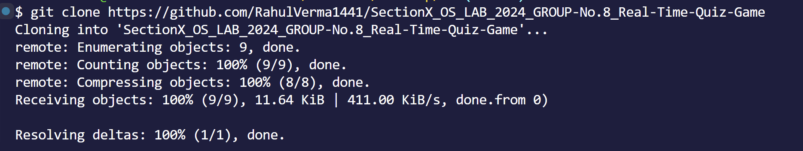
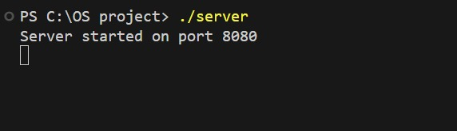
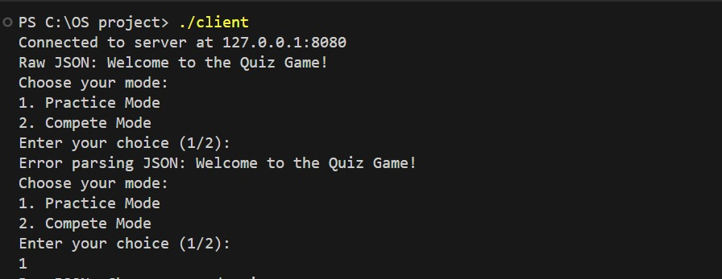
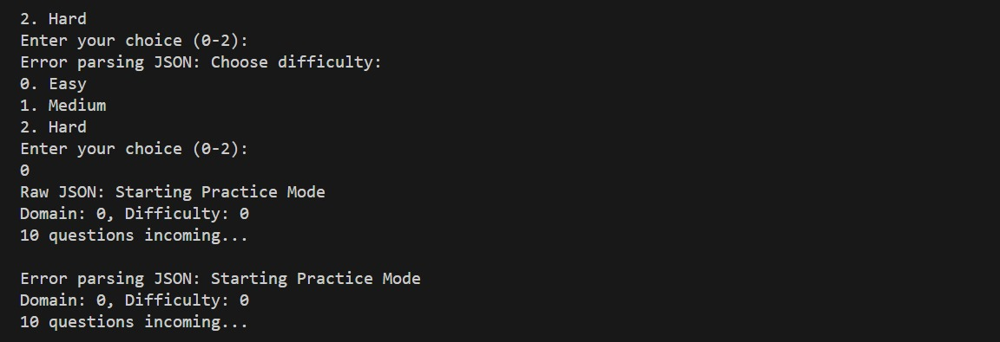

# Steps to Execute the TCP-Based Real-Time Quiz Game

## Repository
The project repository is available at: [Real-Time Quiz Game Repository](https://github.com/RahulVerma1441/SectionX_OS_LAB_2024_GROUP-No.8_Real-Time-Quiz-Game)

---

## Prerequisites

1. **C Compiler**
   - Ensure you have a C compiler installed on your system (e.g., GCC for Linux/MacOS or MinGW for Windows).

2. **Networking**
   - Both the server and client systems must be connected to the same network.

3. **Operating System**
   - Recommended for Unix/Linux systems (can be adapted for Windows with minor adjustments).

---

## Steps to Execute

### 1. Clone or Download the Repository
Clone the repository to your local machine:
```bash
git clone https://github.com/RahulVerma1441/SectionX_OS_LAB_2024_GROUP-No.8_Real-Time-Quiz-Game
```
Or download the repository as a ZIP file and extract it.



### 2. Navigate to the Project Directory
Open a terminal and move to the project folder:
```bash
cd SectionX_OS_LAB_2024_GROUP-No.8_Real-Time-Quiz-Game
```


### 3. Compile the Server Code
Compile the server code using your C compiler:
```bash
gcc quiz_server.c -o server
```

### 4. Compile the Client Code
Similarly, compile the client code:
```bash
gcc quiz_client.c -o client
```

### 5. Start the Server
Run the server executable in a terminal:
```bash
./server
```


The server will now be ready to accept client connections.

### 6. Start the Client(s)
Run the client executable in separate terminal windows for each participant:
```bash
./client
```


You can start multiple clients to simulate a multiplayer environment.

### 7. Gameplay
- Follow the instructions displayed on the client screens.
- Answer questions within the allotted time.
- The server will manage scores and coordinate gameplay between clients.


### 8. Shut Down
- To stop the server or a client, press `Ctrl + C` in their respective terminal windows.

---

## Troubleshooting

### Common Issues and Solutions

1. **Error: Address already in use**
   - Ensure no other program is using the specified port.
   - Modify the port number in `quiz_server.c` and `quiz_client.c` if necessary.

2. **Error: Unable to connect to the server**
   - Verify the server is running and accessible on the network.
   - Check the IP address and port in the `quiz_client.c` file to ensure they match the server's configuration.

3. **Compilation Errors**
   - Ensure your C compiler supports the required features.
   - Check for missing dependencies or syntax errors.

---

## Notes
- Make sure to test the program on the same network to avoid firewall or NAT traversal issues.
- The server should always be started before the clients.

For more details, refer to the [README](https://github.com/RahulVerma1441/SectionX_OS_LAB_2024_GROUP-No.8_Real-Time-Quiz-Game/blob/main/README.md) in the repository.

---

